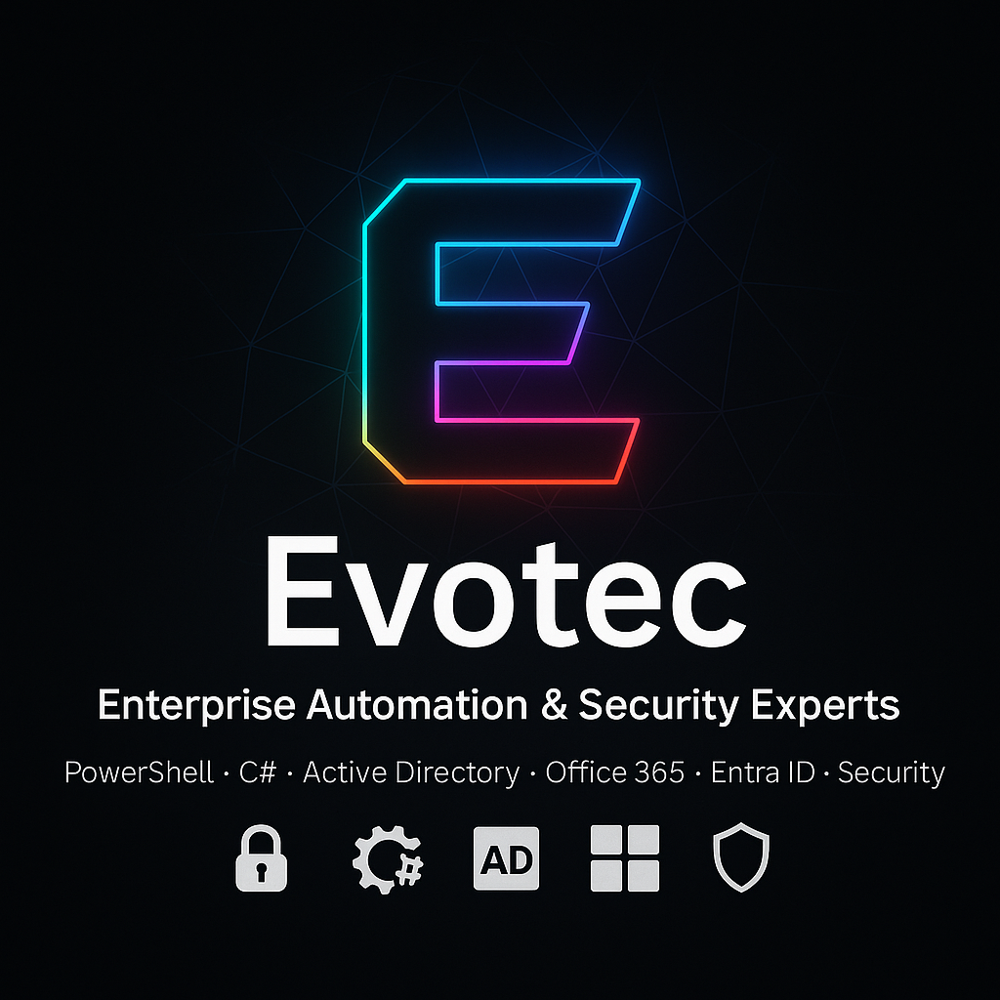

  

# EvotecIT

🚀 Enterprise Automation & Security Experts
Passionate about building better IT through PowerShell, C#, and Microsoft technologies.

---

### What We Do
- 🔒 **Security & AD Health** – Active Directory, PKI, DNS, Email, Azure AD
- ⚙️ **Automation & DevOps** – PowerShell modules, CI/CD, Infrastructure as Code
- ☁️ **Cloud Expertise** – Office 365, Exchange, Azure AD
- 📊 **Reporting & Insights** – Custom tooling, health checks, diagnostics

---

### 🌍 Community & Open Source
EvotecIT is the home of widely used **open-source projects** trusted by IT admins and enterprises worldwide:

- [GPOZaurr](https://github.com/EvotecIT/GPOZaurr) – GPO management & reporting
- [TestimoX](https://github.com/EvotecIT/TestimoX) – Active Directory health analyzer
- [OfficeIMO](https://github.com/EvotecIT/OfficeIMO) – Word/Excel/PowerPoint automation
- [Mailozaurr](https://github.com/EvotecIT/Mailozaurr) – Email diagnostics & automation
- [DomainDetective](https://github.com/EvotecIT/DomainDetective) – DNS & email security checks
- And many more on [GitHub](https://github.com/EvotecIT)

---

### 📖 Knowledge Sharing
We run [**Evotec.xyz**](https://evotec.xyz), a blog full of deep-dive articles, tutorials, and insights on:
- Active Directory & Azure AD
- Exchange & Office 365
- PowerShell & C# automation
- Security best practices

---

### 🤝 Work With Us
We help enterprises:
- Modernize their IT infrastructure
- Improve security posture
- Automate repetitive processes
- Deliver better reporting & insights

💡 Whether it’s consulting, architecture, or custom tooling — we’ve got you covered.

---

### 📬 Connect
🌐 [Website](https://evotec.xyz) • 🐦 [Twitter](https://twitter.com/PrzemyslawKlys) • 💼 [LinkedIn Evotec](https://www.linkedin.com/company/evotec-poland) • 💼 [LinkedIn Przemysław Klys](https://www.linkedin.com/in/pklys/) • 📧 [Contact](mailto:conect@evotec.pl)

---
